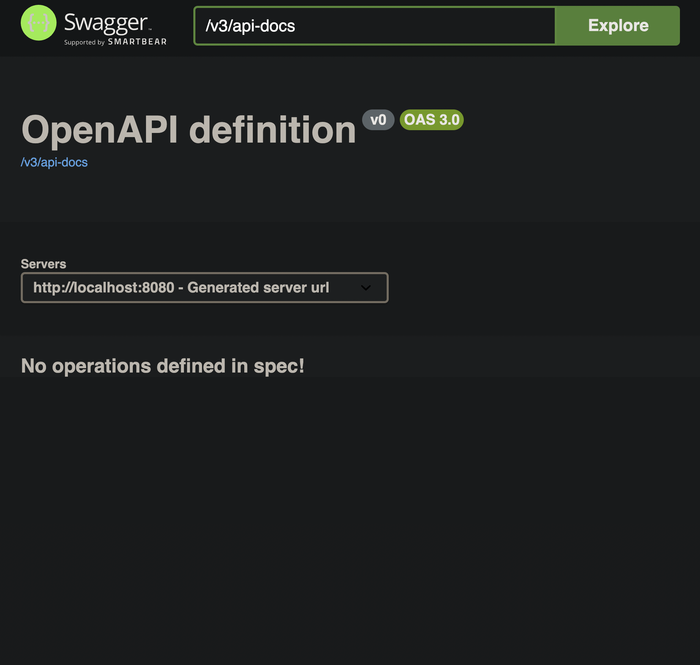

# Spring_Boot_Weather_Forecast

## EndPoint Documentation

| Method | Endpoint                | Description                                                                                                                                                                                                                                                                                           | Example Request                                |
| ------ | ----------------------- | ----------------------------------------------------------------------------------------------------------------------------------------------------------------------------------------------------------------------------------------------------------------------------------------------------- | ---------------------------------------------- |
| GET    | `/v1/forecasts`         | Forecasts weather for the next 3 days for the 5 biggest cities in Poland, including: <ol><li>Max/min/avg temperatures (°C)</li><li>Max wind speed (km/h)</li><li>Total Precipitation (mm)</li><li>Total Snowfall (cm)</li><li>Avg humidity (%)</li><li>Avg Visibility (km)</li><li>UV index</li></ol> | `GET https://example.com/v1/forecasts`         |
| GET    | `/v1/forecasts/warsaw`  | Warsaw's weather forecast for the next 3 days, including: <ol><li>Max/min/avg temperatures (°C)</li><li>Max wind speed (km/h)</li><li>Total Precipitation (mm)</li><li>Total Snowfall (cm)</li><li>Avg humidity (%)</li><li>Avg Visibility (km)</li><li>UV index</li></ol>                            | `GET https://example.com/v1/forecasts/warsaw`  |
| GET    | `/v1/forecasts/lodz`    | Lodz's weather forecast for the next 3 days, including: <ol><li>Max/min/avg temperatures (°C)</li><li>Max wind speed (km/h)</li><li>Total Precipitation (mm)</li><li>Total Snowfall (cm)</li><li>Avg humidity (%)</li><li>Avg Visibility (km)</li><li>UV index</li></ol>                              | `GET https://example.com/v1/forecasts/lodz`    |
| GET    | `/v1/forecasts/krakow`  | Krakow's weather forecast for the next 3 days, including: <ol><li>Max/min/avg temperatures (°C)</li><li>Max wind speed (km/h)</li><li>Total Precipitation (mm)</li><li>Total Snowfall (cm)</li><li>Avg humidity (%)</li><li>Avg Visibility (km)</li><li>UV index</li></ol>                            | `GET https://example.com/v1/forecasts/krakow`  |
| GET    | `/v1/forecasts/wroclaw` | Wroclaw's weather forecast for the next 3 days, including: <ol><li>Max/min/avg temperatures (°C)</li><li>Max wind speed (km/h)</li><li>Total Precipitation (mm)</li><li>Total Snowfall (cm)</li><li>Avg humidity (%)</li><li>Avg Visibility (km)</li><li>UV index</li></ol>                           | `GET https://example.com/v1/forecasts/wroclaw` |
| GET    | `/v1/forecasts/poznan`  | Poznan's weather forecast for the next 3 days, including: <ol><li>Max/min/avg temperatures (°C)</li><li>Max wind speed (km/h)</li><li>Total Precipitation (mm)</li><li>Total Snowfall (cm)</li><li>Avg humidity (%)</li><li>Avg Visibility (km)</li><li>UV index</li></ol>                            | `GET https://example.com/v1/forecasts/poznan`  |
| GET    | `/v1/forecasts/{city}`  | Weather forecast for the next 3 days for a specified city, including: <ol><li>Max/min/avg temperatures (°C)</li><li>Max wind speed (km/h)</li><li>Total Precipitation (mm)</li><li>Total Snowfall (cm)</li><li>Avg humidity (%)</li><li>Avg Visibility (km)</li><li>UV index</li></ol>                | `GET https://example.com/v1/forecasts/{city}`  |

## Swagger Docs SetUp

