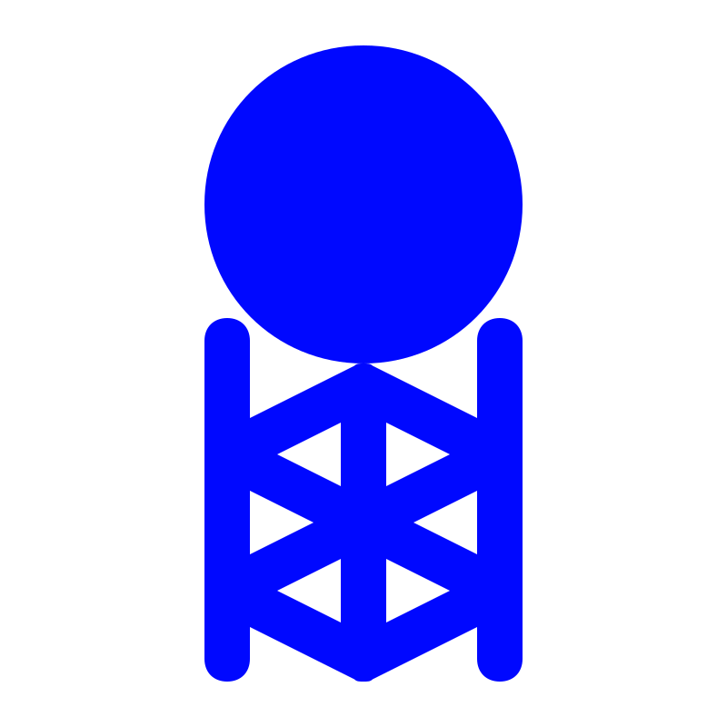
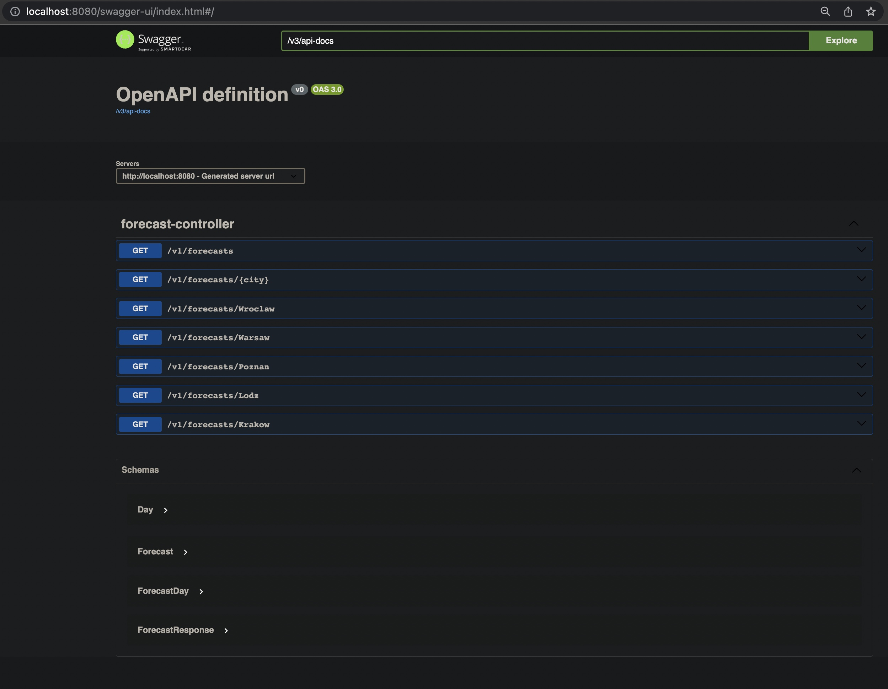
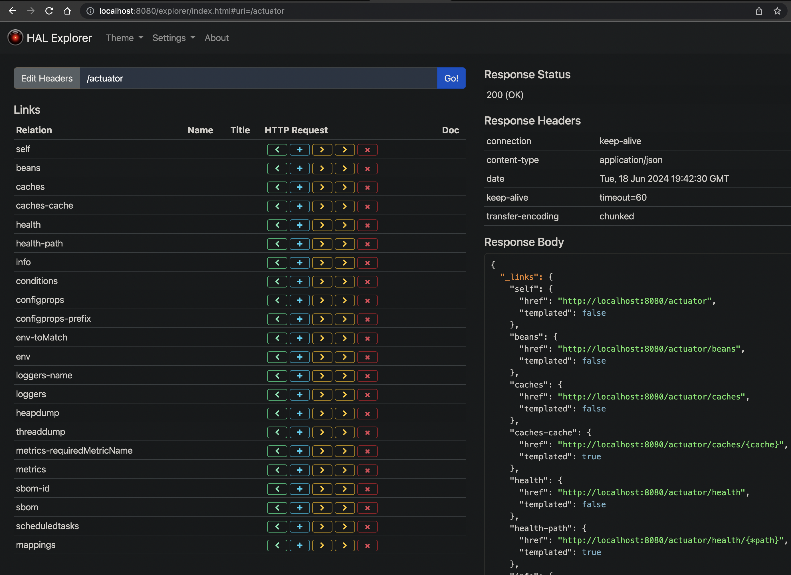

<a name="readme-top"></a>

[![Contributors][contributors-shield]][contributors-url]
[![Forks][forks-shield]][forks-url]
[![Stargazers][stars-shield]][stars-url]
[![Issues][issues-shield]][issues-url]
[![MIT License][license-shield]][license-url]
[![LinkedIn][linkedin-shield]][linkedin-url]

<!-- PROJECT LOGO -->
<br />
<div align="center">
  <a href="https://github.com/MateuszKrolik/Spring_Boot_Weather_Forecast">
    
  </a>

<h3 align="center">Spring Boot Weather Forecast Rest API</h3>
  <p align="center">
    <br />
    <a href="https://github.com/MateuszKrolik/Spring_Boot_Weather_Forecast"><strong>Explore the docs »</strong></a>
    <br />
    <br />
    <a href="https://github.com/MateuszKrolik/Spring_Boot_Weather_Forecast">View Demo</a>
    ·
    <a href="https://github.com/MateuszKrolik/Spring_Boot_Weather_Forecast/issues">Report Bug</a>
    ·
    <a href="https://github.com/MateuszKrolik/Spring_Boot_Weather_Forecast/issues">Request Feature</a>
  </p>
</div>

<!-- TABLE OF CONTENTS -->
<details>
  <summary>Table of Contents</summary>
  <ol>
    <li>
      <a href="#about-the-project">About The Project</a>
      <ul>
        <li><a href="#built-with">Built With</a></li>
      </ul>
    </li>
    <li>
      <a href="#getting-started">Getting Started</a>
      <ul>
        <li><a href="#installation">Installation</a></li>
      </ul>
    </li>
    <li><a href="#roadmap">Roadmap</a></li>
    <li><a href="#contributing">Contributing</a></li>
    <li><a href="#license">License</a></li>
    <li><a href="#contact">Contact</a></li>
    <li><a href="#acknowledgments">Acknowledgments</a></li>
  </ol>
</details>

<!-- ABOUT THE PROJECT -->

## About The Project

### Click below link to see the RESTful API 😉

[![Product Name Screen Shot][product-screenshot]](https://mkrolik-spring-weather-forecast-api-5c7rko7tja-ew.a.run.app/swagger-ui/index.html)

## EndPoint Documentation

| Method | Endpoint                | Description                                                                                                                                                                                                                                                                                           | Example Request                                |
| ------ | ----------------------- | ----------------------------------------------------------------------------------------------------------------------------------------------------------------------------------------------------------------------------------------------------------------------------------------------------- | ---------------------------------------------- |
| GET    | `/v1/forecasts`         | Forecasts weather for the next 3 days for the 5 biggest cities in Poland, including: <ol><li>Max/min/avg temperatures (°C)</li><li>Max wind speed (km/h)</li><li>Total Precipitation (mm)</li><li>Total Snowfall (cm)</li><li>Avg humidity (%)</li><li>Avg Visibility (km)</li><li>UV index</li></ol> | `GET https://example.com/v1/forecasts`         |
| GET    | `/v1/forecasts/warsaw`  | Warsaw's weather forecast for the next 3 days, including: <ol><li>Max/min/avg temperatures (°C)</li><li>Max wind speed (km/h)</li><li>Total Precipitation (mm)</li><li>Total Snowfall (cm)</li><li>Avg humidity (%)</li><li>Avg Visibility (km)</li><li>UV index</li></ol>                            | `GET https://example.com/v1/forecasts/warsaw`  |
| GET    | `/v1/forecasts/lodz`    | Lodz's weather forecast for the next 3 days, including: <ol><li>Max/min/avg temperatures (°C)</li><li>Max wind speed (km/h)</li><li>Total Precipitation (mm)</li><li>Total Snowfall (cm)</li><li>Avg humidity (%)</li><li>Avg Visibility (km)</li><li>UV index</li></ol>                              | `GET https://example.com/v1/forecasts/lodz`    |
| GET    | `/v1/forecasts/krakow`  | Krakow's weather forecast for the next 3 days, including: <ol><li>Max/min/avg temperatures (°C)</li><li>Max wind speed (km/h)</li><li>Total Precipitation (mm)</li><li>Total Snowfall (cm)</li><li>Avg humidity (%)</li><li>Avg Visibility (km)</li><li>UV index</li></ol>                            | `GET https://example.com/v1/forecasts/krakow`  |
| GET    | `/v1/forecasts/wroclaw` | Wroclaw's weather forecast for the next 3 days, including: <ol><li>Max/min/avg temperatures (°C)</li><li>Max wind speed (km/h)</li><li>Total Precipitation (mm)</li><li>Total Snowfall (cm)</li><li>Avg humidity (%)</li><li>Avg Visibility (km)</li><li>UV index</li></ol>                           | `GET https://example.com/v1/forecasts/wroclaw` |
| GET    | `/v1/forecasts/poznan`  | Poznan's weather forecast for the next 3 days, including: <ol><li>Max/min/avg temperatures (°C)</li><li>Max wind speed (km/h)</li><li>Total Precipitation (mm)</li><li>Total Snowfall (cm)</li><li>Avg humidity (%)</li><li>Avg Visibility (km)</li><li>UV index</li></ol>                            | `GET https://example.com/v1/forecasts/poznan`  |
| GET    | `/v1/forecasts/{city}`  | Weather forecast for the next 3 days for a specified city, including: <ol><li>Max/min/avg temperatures (°C)</li><li>Max wind speed (km/h)</li><li>Total Precipitation (mm)</li><li>Total Snowfall (cm)</li><li>Avg humidity (%)</li><li>Avg Visibility (km)</li><li>UV index</li></ol>                | `GET https://example.com/v1/forecasts/{city}`  |

## Swagger Docs SetUp

[](https://mkrolik-spring-weather-forecast-api-5c7rko7tja-ew.a.run.app/swagger-ui/index.html)

## HalExplorer Angular-based WebApp and Actuator Monitoring

[](https://mkrolik-spring-weather-forecast-api-5c7rko7tja-ew.a.run.app/explorer/index.html#uri=/actuator)

<p align="right">(<a href="#readme-top">back to top</a>)</p>

### Built With

<!-- Primary Technologies -->

- [![MVC][MVC]][MVC-url]
- [![REST API][REST API]][REST API-url]

<!-- Programming Languages -->

- [![Java][Java]][Java-url]

<!-- Web Technologies -->

- [![Spring][Spring]][Spring-url]
- [![Spring Boot][Spring Boot]][Spring Boot-url]
- [![Apache][Apache]][Apache-url]
- [![Apache Tomcat][Apache Tomcat]][Apache Tomcat-url]
- [![Maven][Maven]][Maven-url]
- [![Oracle][Oracle]][Oracle-url]

<!-- Testing and Version Control -->

- [![SwaggerUI/OpenAPI][SwaggerUI/OpenAPI]][SwaggerUI/OpenAPI-url]
- [![Mockito][Mockito]][Mockito-url]
- [![JUnit][JUnit]][JUnit-url]
- [![GitHub Actions][GitHub Actions]][GitHub Actions-url]
- [![Postman][Postman]][Postman-url]

<!-- Containerization -->

- [![Docker][Docker]][Docker-url]
- [![Linux/Unix][Linux/Unix]][Linux/Unix-url]
- [![Bash][Bash]][Bash-url]

<!-- Cloud Technologies -->

- [![GCP Cloud Build][GCP Cloud Build]][GCP Cloud Build-url]
- [![GCP Artifact Registry][GCP Artifact Registry]][GCP Artifact Registry-url]
- [![GCP Cloud Run][GCP Cloud Run]][GCP Cloud Run-url]

- [![Google Cloud Platform][Google Cloud Platform]][Google Cloud Platform-url]

- [![GCP Secret Manager][GCP Secret Manager]][GCP Secret Manager-url]
- [![GCP IAM][GCP IAM]][GCP IAM-url]

<!-- Data Formats -->

- [![YAML][YAML]][YAML-url]
- [![XML][XML]][XML-url]
- [![JSON][JSON]][JSON-url]
- [![.env][.env]][.env-url]

<!-- IDEs and Editors -->

- [![VSCode][VSCode]][VSCode-url]

<p align="right">(<a href="#readme-top">back to top</a>)</p>

<!-- GETTING STARTED -->

## Getting Started

As a prerequisite i recommend having VScode with Java and Spring Boot Extension Packs, JDK21, Maven , as well as Docker for Desktop and the GCloud CLI for my GCP Account Role BASH Script.

### Installation

0. Get a free API Key:

```txt
https://www.weatherapi.com/ 
```

1. Clone the repo

```sh
git clone https://github.com/MateuszKrolik/Spring_Boot_Weather_Forecast.git
```

2. Install Build Image w/ Docker-Compose

```sh
docker-compose up --build -d
```

3. Enter your environment variables in `.env` and `GCP Secret Manager`.

```sh
WEATHER_API_KEY=YOUR_WEATHER_API_KEY;
GCLOUD_PROJECT_NUMBER = YOUR_GCLOUD_PROJECT_NUMBER;
GCLOUD_ID = YOUR_GCLOUD_ID;
```

4. When deploying remember to create a GitHub master branch trigger in GCP Cloud Build, and don't forget to set all the necessary IAM Roles using my BASH script for the Recommended Custom Service Account:

```sh
chmod +x gcloud_custom.sh
```

```bash
#! /bin/bash

source .env

gcloud iam service-accounts create build-sbwfa-dev-sa \
  --description="Service account for build process in Spring Boot Weather Forecast API development environment" \
  --display-name="Build SBWFA Dev SA" \
  --project=$GCLOUD_ID

SA_EMAIL="build-sbwfa-dev-sa@$GCLOUD_ID.iam.gserviceaccount.com"

gcloud projects add-iam-policy-binding $GCLOUD_ID \
  --member=serviceAccount:$SA_EMAIL \
  --role=roles/artifactregistry.writer

gcloud projects add-iam-policy-binding $GCLOUD_ID \
  --member=serviceAccount:$SA_EMAIL \
  --role=roles/run.admin

gcloud projects add-iam-policy-binding $GCLOUD_ID \
  --member=serviceAccount:$SA_EMAIL \
  --role=roles/iam.serviceAccountUser

gcloud projects add-iam-policy-binding $GCLOUD_ID \
  --member=serviceAccount:$SA_EMAIL \
  --role=roles/secretmanager.secretAccessor

gcloud projects add-iam-policy-binding $GCLOUD_ID \
  --member=serviceAccount:$SA_EMAIL \
  --role=roles/cloudbuild.builds.editor

gcloud projects add-iam-policy-binding $GCLOUD_ID \
  --member=serviceAccount:$SA_EMAIL \
  --role=roles/logging.admin

gcloud projects get-iam-policy $GCLOUD_PROJECT_NUMBER  \
  --flatten="bindings[].members" \
  --format='table(bindings.role)' \
  --filter="bindings.members:build-sbwfa-dev-sa@$GCLOUD_ID.iam.gserviceaccount.com"

# ROLE
# roles/artifactregistry.writer
# roles/cloudbuild.builds.editor
# roles/iam.serviceAccountUser
# roles/logging.admin
# roles/logging.logWriter
# roles/run.admin
# roles/secretmanager.secretAccessor

# To avoid CloudBuild Error - "Permission denied on secret":

gcloud projects add-iam-policy-binding $GCLOUD_PROJECT_NUMBER \
  --member="serviceAccount:$GCLOUD_PROJECT_NUMBER-compute@developer.gserviceaccount.com" \
  --role="roles/secretmanager.secretAccessor"


gcloud projects get-iam-policy $GCLOUD_PROJECT_NUMBER \
  --flatten="bindings[].members" \
  --format='table(bindings.role)' \
  --filter="$GCLOUD_PROJECT_NUMBER-compute@developer.gserviceaccount.com"

# ROLE
# roles/editor
# roles/secretmanager.secretAccessor
```

```sh
./gcloud_custom.sh
```

<p align="right">(<a href="#readme-top">back to top</a>)</p>

<!-- ROADMAP -->

## Roadmap

- [x] Monolithic Architecture: Model-View-Controller (MVC)
- [x] DTO (Data Transfer Object) Java Record with BigDecimal Fields instead of double data type for increased accuracy
- [x] Reactive Programming using Spring WebFlux
- [x] Containerization via Docker and Docker-Compose
- [x] Constructor-based Dependency Injection and Bean AutoWiring using Spring Framework
- [x] Starter-Projects and Auto-Configuration using Spring Boot Framework
- [x] Monitoring using Spring Boot Actuator
- [x] Apache Tomcat Production WebServer
- [x] SwaggerUI Documentation Auto-Generation
- [x] Angular-based HAL Explorer UI
- [x] Exception Handling
- [x] Content Negotiation - Support for XML Accept-Headers using Jackson DataFormat XML
- [x] HTTP Status Codes
- [x] GET HTTP Verbs
- [x] Test-Driven-Development(TDD) - WebLayer Unit Testing, Mocking and Stubbing via:
  - [x] JUnit
  - [x] Mockito
- [x] Environment Variables with FallBack values for Local Development
- [x] SSL/TLS Encryption
- [x] Infrastructure-as-Code (IaC) via CloudBuild YAML file
- [x] Automatized Dockerized CI/CD&IaC Serverless Deployment via:
  - [x] GitHub Master Branch Commit Trigger
  - [x] GCP Cloud Build (IaC & CI/CD)
  - [x] GCP Cloud Run (FaaS/PaaS)
  - [x] GCP Artifact Registry
  - [x] GCP Secret Manager (.ENV)
  - [x] GCP IAM Roles (Least Priveleged Principle)
- [x] Best Practices

See the [open issues](https://github.com/MateuszKrolik/Spring_Boot_Weather_Forecast/issues) for a full list of proposed features (and known issues).

<p align="right">(<a href="#readme-top">back to top</a>)</p>

<!-- CONTRIBUTING -->

## Contributing

Contributions are what make the open source community such an amazing place to learn, inspire, and create. Any contributions you make are **greatly appreciated**.

If you have a suggestion that would make this better, please fork the repo and create a pull request. You can also simply open an issue with the tag "enhancement".
Don't forget to give the project a star! Thanks again!

1. Fork the Project
2. Create your Feature Branch (`git checkout -b feature/AmazingFeature`)
3. Commit your Changes (`git commit -m 'Add some AmazingFeature'`)
4. Push to the Branch (`git push origin feature/AmazingFeature`)
5. Open a Pull Request

<p align="right">(<a href="#readme-top">back to top</a>)</p>

<!-- LICENSE -->

## License

Distributed under the MIT License. See `LICENSE` for more information.

<p align="right">(<a href="#readme-top">back to top</a>)</p>

<!-- CONTACT -->

## Contact

Mateusz Królik - [Mateusz Królik](https://www.linkedin.com/in/mateusz-kr%C3%B3lik-8b1862262/) - [mateuszkrolik87@gmail.com](mailto:mateuszkrolik7@gmail.com)

Project Link: [Project Link](https://mkrolik-spring-weather-forecast-api-5c7rko7tja-ew.a.run.app/swagger-ui/index.html)

GitHub Repository Link: [GitHub Repository Link](https://github.com/MateuszKrolik/Spring_Boot_Weather_Forecast)

<p align="right">(<a href="#readme-top">back to top</a>)</p>

<!-- ACKNOWLEDGMENTS -->

## Acknowledgments

- [Weather API](https://www.weatherapi.com/)
- [Img Shields](https://shields.io)
- [GitHub Emoji Cheat Sheet](https://www.webpagefx.com/tools/emoji-cheat-sheet)
- [Malven's Flexbox Cheatsheet](https://flexbox.malven.co/)
- [Malven's Grid Cheatsheet](https://grid.malven.co/)
- [SVG Repo](https://www.svgrepo.com/)

<p align="right">(<a href="#readme-top">back to top</a>)</p>

<!-- MARKDOWN LINKS & IMAGES -->
<!-- https://www.markdownguide.org/basic-syntax/#reference-style-links -->

[contributors-shield]: https://img.shields.io/github/contributors/MateuszKrolik/Spring_Boot_Weather_Forecast.svg?style=for-the-badge
[contributors-url]: https://github.com/MateuszKrolik/Spring_Boot_Weather_Forecast/graphs/contributors
[forks-shield]: https://img.shields.io/github/forks/MateuszKrolik/Spring_Boot_Weather_Forecast.svg?style=for-the-badge
[forks-url]: https://github.com/MateuszKrolik/Spring_Boot_Weather_Forecast/network/members
[stars-shield]: https://img.shields.io/github/stars/MateuszKrolik/Spring_Boot_Weather_Forecast.svg?style=for-the-badge
[stars-url]: https://github.com/MateuszKrolik/Spring_Boot_Weather_Forecast/stargazers
[issues-shield]: https://img.shields.io/github/issues/MateuszKrolik/Spring_Boot_Weather_Forecast.svg?style=for-the-badge
[issues-url]: https://github.com/MateuszKrolik/Spring_Boot_Weather_Forecast/issues
[license-shield]: https://img.shields.io/github/license/MateuszKrolik/Spring_Boot_Weather_Forecast.svg?style=for-the-badge
[license-url]: https://github.com/MateuszKrolik/Spring_Boot_Weather_Forecast/blob/master/LICENSE
[linkedin-shield]: https://img.shields.io/badge/-LinkedIn-black.svg?style=for-the-badge&logo=linkedin&colorB=555
[linkedin-url]: https://linkedin.com/in/mateusz-królik-8b1862262
[product-screenshot]: images/swagger.jpeg
[Docker]: https://img.shields.io/badge/Docker-2CA5E0?style=for-the-badge&logo=docker&logoColor=white
[Docker-url]: https://www.docker.com/
[Linux/Unix]: https://img.shields.io/badge/Linux-FCC624?style=for-the-badge&logo=linux&logoColor=black
[Linux/Unix-url]: https://www.linux.org/
[Google Cloud Platform]: https://img.shields.io/badge/Google_Cloud-4285F4?style=for-the-badge&logo=google-cloud&logoColor=white
[Google Cloud Platform-url]: https://cloud.google.com/
[Bash]: https://img.shields.io/badge/Bash-4EAA4B?style=for-the-badge&logo=gnu-bash&logoColor=white
[Bash-url]: https://www.gnu.org/software/bash/
[GCP Artifact Registry]: https://img.shields.io/badge/GCP_Artifact_Registry-FFFFFF?style=for-the-badge&logo=data:image/svg+xml;base64,PHN2ZyB2ZXJzaW9uPSIxLjEiIGJhc2VQcm9maWxlPSJ0aW55IiBpZD0iTGF5ZXJfMSIgeG1sbnM9Imh0dHA6Ly93d3cudzMub3JnLzIwMDAvc3ZnIiB4bWxuczp4bGluaz0iaHR0cDovL3d3dy53My5vcmcvMTk5OS94bGluayIKCSB4PSIwcHgiIHk9IjBweCIgd2lkdGg9IjI0cHgiIGhlaWdodD0iMjRweCIgdmlld0JveD0iMCAwIDI0IDI0IiBvdmVyZmxvdz0idmlzaWJsZSIgeG1sOnNwYWNlPSJwcmVzZXJ2ZSI+CjxnID4KCTxyZWN0IHk9IjAiIGZpbGw9Im5vbmUiIHdpZHRoPSIyNCIgaGVpZ2h0PSIyNCIvPgoJPHBvbHlnb24gZmlsbC1ydWxlPSJldmVub2RkIiBmaWxsPSIjNUM4NURFIiBwb2ludHM9IjYsMi40IDAuOCw1LjQgMC44LDE5LjEgNiwyMi4xIDYsMTkuNSAzLDE3LjggMyw2LjcgNiw1IAkiLz4KCTxwb2x5Z29uIGZpbGwtcnVsZT0iZXZlbm9kZCIgZmlsbD0iIzMzNjdENiIgcG9pbnRzPSIwLjgsOCAwLjgsMTYuNSAzLDE3LjggMyw2LjcgCSIvPgoJPHBvbHlnb24gZmlsbC1ydWxlPSJldmVub2RkIiBmaWxsPSIjMzM2N0Q2IiBwb2ludHM9IjAuOCw4IDMsNy41IDMsNi43IAkiLz4KCTxwb2x5Z29uIGZpbGwtcnVsZT0iZXZlbm9kZCIgZmlsbD0iIzVDODVERSIgcG9pbnRzPSIxOCwyLjQgMTgsNSAyMSw2LjcgMjEsMTcuOCAxOCwxOS41IDE4LDIyLjEgMjMuMiwxOS4xIDIzLjIsNS40IAkiLz4KCTxwb2x5Z29uIGZpbGwtcnVsZT0iZXZlbm9kZCIgZmlsbD0iIzMzNjdENiIgcG9pbnRzPSIyMSwxNy44IDIzLjIsMTYuNSAyMy4yLDggMjEsNi43IAkiLz4KCTxwb2x5Z29uIGZpbGwtcnVsZT0iZXZlbm9kZCIgZmlsbD0iIzMzNjdENiIgcG9pbnRzPSIyMSw3LjUgMjMuMiw4IDIxLDYuNyAJIi8+Cgk8cG9seWdvbiBmaWxsLXJ1bGU9ImV2ZW5vZGQiIGZpbGw9IiMzMzY3RDYiIHBvaW50cz0iMjEsMTcuMSAyMSwxNy44IDIzLjIsMTYuNSAJIi8+Cgk8ZyB0cmFuc2Zvcm09InRyYW5zbGF0ZSg2Ljg2MDAwMCwgNi41MDAwMDApIj4KCQk8ZyB0cmFuc2Zvcm09InRyYW5zbGF0ZSg0LjU0MDAwMCwgMC4wMDAwMDApIj4KCQkJPHBvbHlnb24gZmlsbC1ydWxlPSJldmVub2RkIiBmaWxsPSIjNUM4NURFIiBwb2ludHM9IjAuNiwtMSAtMi40LDAuNiAwLjYsMi4yIDMuNiwwLjYgCQkJIi8+CgkJCTxwb2x5Z29uIGZpbGwtcnVsZT0iZXZlbm9kZCIgZmlsbD0iIzMzNjdENiIgcG9pbnRzPSIxLDUuOSAzLjksNC4zIDMuOSwxLjIgMSwyLjggCQkJIi8+CgkJCTxwb2x5Z29uIGZpbGwtcnVsZT0iZXZlbm9kZCIgZmlsbD0iIzMzNjdENiIgcG9pbnRzPSIwLjMsMi44IC0yLjcsMS4yIC0yLjcsNC4zIDAuMyw1LjkgCQkJIi8+CgkJPC9nPgoJCTxnIHRyYW5zZm9ybT0idHJhbnNsYXRlKDAuMDAwMDAwLCA3Ljk3NjE5MCkiPgoJCQk8cG9seWdvbiBmaWxsLXJ1bGU9ImV2ZW5vZGQiIGZpbGw9IiM1Qzg1REUiIHBvaW50cz0iMS43LC0zLjEgLTEuMiwtMS41IDEuNywwLjEgNC41LC0xLjUgCQkJIi8+CgkJCTxwb2x5Z29uIGZpbGwtcnVsZT0iZXZlbm9kZCIgZmlsbD0iIzMzNjdENiIgcG9pbnRzPSIxLjksMy44IDQuOCwyLjIgNC44LC0xIDEuOSwwLjYgCQkJIi8+CgkJCTxwb2x5Z29uIGZpbGwtcnVsZT0iZXZlbm9kZCIgZmlsbD0iIzMzNjdENiIgcG9pbnRzPSIxLjQsMC42IC0xLjUsLTEgLTEuNSwyLjIgMS40LDMuOCAJCQkiLz4KCQk8L2c+CgkJPGcgdHJhbnNmb3JtPSJ0cmFuc2xhdGUoOS4zNjAwMDAsIDcuOTc2MTkwKSI+CgkJCTxwb2x5Z29uIGZpbGwtcnVsZT0iZXZlbm9kZCIgZmlsbD0iIzVDODVERSIgcG9pbnRzPSItMC43LC0zLjEgLTMuNiwtMS41IC0wLjcsMC4xIDIuMiwtMS41IAkJCSIvPgoJCQk8cG9seWdvbiBmaWxsLXJ1bGU9ImV2ZW5vZGQiIGZpbGw9IiMzMzY3RDYiIHBvaW50cz0iLTAuNCwzLjggMi41LDIuMiAyLjUsLTEgLTAuNCwwLjYgCQkJIi8+CgkJCTxwb2x5Z29uIGZpbGwtcnVsZT0iZXZlbm9kZCIgZmlsbD0iIzMzNjdENiIgcG9pbnRzPSItMSwwLjYgLTMuOSwtMSAtMy45LDIuMiAtMSwzLjggCQkJIi8+CgkJPC9nPgoJPC9nPgo8L2c+Cjwvc3ZnPgo=
[GCP Artifact Registry-url]: https://cloud.google.com/artifact-registry
[GCP Cloud Run]: https://img.shields.io/badge/GCP_Cloud_Run-808080?style=for-the-badge&logo=data:image/svg+xml;base64,PD94bWwgdmVyc2lvbj0iMS4wIiBlbmNvZGluZz0iVVRGLTgiPz4KPCEtLSBVcGxvYWRlZCB0bzogU1ZHIFJlcG8sIHd3dy5zdmdyZXBvLmNvbSwgR2VuZXJhdG9yOiBTVkcgUmVwbyBNaXhlciBUb29scyAtLT4KPHN2ZyB3aWR0aD0iODAwcHgiIGhlaWdodD0iODAwcHgiIHZpZXdCb3g9IjAgLTEyLjUgMjU2IDI1NiIgdmVyc2lvbj0iMS4xIiB4bWxucz0iaHR0cDovL3d3dy53My5vcmcvMjAwMC9zdmciIHhtbG5zOnhsaW5rPSJodHRwOi8vd3d3LnczLm9yZy8xOTk5L3hsaW5rIiBwcmVzZXJ2ZUFzcGVjdFJhdGlvPSJ4TWlkWU1pZCI+CgkJPGc+CgkJCQk8cGF0aCBkPSJNNzUuMzkwMTQ3LDAgQzY3LjE5NjQzNjUsMC4xNDQyNDk0NDMgNTkuNjkyNjE0Nyw0LjYxOTQwMzEyIDU1LjY3MDczNSwxMS43NTk0NjU1IEw1NS42NzA3MzUsMTEuNzU5NDY1NSBMMy4wNTI3NTcyNCwxMDIuOTk1ODEzIEMtMS4wMTc1ODU3NSwxMTAuMDc5NDMgLTEuMDE3NTg1NzUsMTE4Ljc5MTk4MiAzLjA1Mjc1NzI0LDEyNS44NzUwMjkgTDMuMDUyNzU3MjQsMTI1Ljg3NTAyOSBMNTUuNjUwNzc5NSwyMTcuODcxOTY0IEM1OS42MzE2MDgsMjI1LjExMTIzNCA2Ny4xMTQ5MDQyLDIyOS43MzM0ODggNzUuMzY5NjIxNCwyMzAuMDUyMjA1IEw3NS4zNjk2MjE0LDIzMC4wNTIyMDUgTDE4MC41ODYxOTIsMjMwLjA1MjIwNSBDMTg4Ljg0MDkwOSwyMjkuNzY4MjY3IDE5Ni4zMzc4ODksMjI1LjE2NDgyOSAyMDAuMzI1NTU5LDIxNy45MzI0MDEgTDIwMC4zMjU1NTksMjE3LjkzMjQwMSBMMjUyLjkyMzU4MSwxMjYuNDU1NDQ4IEMyNTQuOTczMjkyLDEyMi44NTcxOTQgMjU1Ljk5Nzg2MiwxMTguODUxMjc4IDI1NS45OTc4NjIsMTE0Ljg0NTkzMyBMMjU1Ljk5Nzg2MiwxMTQuODQ1OTMzIEMyNTUuOTk3ODYyLDExMC44NDA1ODggMjU0Ljk3MzI5MiwxMDYuODM0NjczIDI1Mi45MjM1ODEsMTAzLjIzNTg0OSBMMjUyLjkyMzU4MSwxMDMuMjM1ODQ5IEwyMDAuMzI1NTU5LDExLjc1OTQ2NTUgQzE5Ni4zMDA4MjksNC42MjIyNTM5IDE4OC43OTkyODcsMC4xNDgyNDA1MzUgMTgwLjYwNjE0NywwIEwxODAuNjA2MTQ3LDAgTDc1LjM5MDE0NywwIFoiIGZpbGw9IiM0Mjg1RjQiPgoNPC9wYXRoPgoJCQkJPHBhdGggZD0iTTIzNi40OTUxNzgsMTU1LjAyNzI0OSBMMjAwLjMyNTU1OSwyMTcuOTMyNDAxIEMxOTYuMzM3ODg5LDIyNS4xNjQ4MjkgMTg4Ljg0MDkwOSwyMjkuNzY4MjY3IDE4MC41ODYxOTIsMjMwLjA1MjIwNSBMMTQwLjUxMDE1OCwyMzAuMDUyMjA1IEw4Mi4wMzgxMDc4LDE3MS4wNTcxNDcgTDk5LjI3NTYzMTIsMTE1LjQ3Mzc4OSBMODIuMDM4MTA3OCw1OS4yNTQxMzYzIEw5OS43NDMxNTksNzEuMTQ3MDE4MyBMMTIzLjU0ODg3OCw5NS4xNjU5NzU5IEwxMTIuNDI5MTI4LDU5LjI1NDEzNjMgTDE5NS44MDQxNjYsMTE1LjI2MTY5MSBMMjM2LjQ5NTE3OCwxNTUuMDI3MjQ5IFoiIGZpbGwtb3BhY2l0eT0iMC4wNyIgZmlsbD0iIzAwMDAwMCIgZmlsbC1ydWxlPSJub256ZXJvIj4KDTwvcGF0aD4KCQkJCTxwYXRoIGQ9Ik04Mi4wMzgyNzg4LDU5LjI1MzkwODIgTDk5Ljc0MzMzMDEsNzEuMTQ3MzYwNCBMMTEzLjYyMjA2NSwxMTUuNzY1NDgxIEw5OS45OTAyMDc2LDE1OS4wNDMxNjQgTDgyLjAzODI3ODgsMTcxLjA1NzQ5IEw5OS4zODA3MTA5LDExNS4yNjE0NjMgTDgyLjAzODI3ODgsNTkuMjUzOTA4MiBaIE0xMjcuMzg1NDU3LDc5LjA4OTkxNzEgTDEzNS45Nzc3MDcsMTA2Ljg4MTU5NiBMMTY4Ljk2NjkyNywxMDYuODgxNTk2IEwxMjcuMzg1NDU3LDc5LjA4OTkxNzEgWiBNMTk1LjgwNDE2NiwxMTUuMjYxNzQ4IEwxMTIuNDI5MTI4LDE3MS4wNTcyMDQgTDEyOS43NzE1NiwxMTUuMjYxNzQ4IEwxMTIuNDI5MTI4LDU5LjI1MzYyMzIgTDE5NS44MDQxNjYsMTE1LjI2MTc0OCBaIiBmaWxsPSIjRkZGRkZGIj4KDTwvcGF0aD4KCQk8L2c+Cjwvc3ZnPg==
[GCP Cloud Run-url]: https://cloud.google.com/run
[JUnit]: https://img.shields.io/badge/JUnit-25A162?style=for-the-badge&logo=junit5&logoColor=white
[JUnit-url]: https://junit.org/
[YAML]: https://img.shields.io/badge/YAML-000000?style=for-the-badge&logo=yaml&logoColor=white
[YAML-url]: https://yaml.org/
[.env]: https://img.shields.io/badge/.env-5A9?style=for-the-badge&logo=dotenv&logoColor=white
[.env-url]: https://github.com/motdotla/dotenv
[GitHub Actions]: https://img.shields.io/badge/GitHub_Actions-2088FF?style=for-the-badge&logo=githubactions&logoColor=white
[GitHub Actions-url]: https://github.com/features/actions
[XML]: https://img.shields.io/badge/XML-1572B6?style=for-the-badge&logo=data:image/svg+xml;base64,PD94bWwgdmVyc2lvbj0iMS4wIiBlbmNvZGluZz0idXRmLTgiPz4KDTwhLS0gVXBsb2FkZWQgdG86IFNWRyBSZXBvLCB3d3cuc3ZncmVwby5jb20sIEdlbmVyYXRvcjogU1ZHIFJlcG8gTWl4ZXIgVG9vbHMgLS0+Cjxzdmcgd2lkdGg9IjgwMHB4IiBoZWlnaHQ9IjgwMHB4IiB2aWV3Qm94PSItNCAwIDY0IDY0IiB4bWxucz0iaHR0cDovL3d3dy53My5vcmcvMjAwMC9zdmciPgoNPHBhdGggZD0iTTUuMTEyLS4wMjRjLTIuODAzIDAtNS4wNzQgMi4yNzItNS4wNzQgNS4wNzR2NTMuODQxYzAgMi44MDMgMi4yNzEgNS4wNzQgNS4wNzQgNS4wNzRoNDUuNzc0YzIuODAxIDAgNS4wNzQtMi4yNzEgNS4wNzQtNS4wNzR2LTM4LjYwNmwtMTguOTAyLTIwLjMwOWgtMzEuOTQ2eiIgZmlsbC1ydWxlPSJldmVub2RkIiBjbGlwLXJ1bGU9ImV2ZW5vZGQiIGZpbGw9IiNGQzdCMjQiLz4KDTxnIGZpbGwtcnVsZT0iZXZlbm9kZCIgY2xpcC1ydWxlPSJldmVub2RkIj4KDTxwYXRoIGQ9Ik01NS45NzcgMjAuMzUydjFoLTEyLjc5OXMtNi4zMTItMS4yNi02LjEyOS02LjcwN2MwIDAgLjIwOCA1LjcwNyA2LjAwNCA1LjcwN2gxMi45MjR6IiBmaWxsPSIjRkI1QzFCIi8+Cg08cGF0aCBkPSJNMzcuMDc0IDB2MTQuNTYxYzAgMS42NTYgMS4xMDQgNS43OTEgNi4xMDQgNS43OTFoMTIuNzk5bC0xOC45MDMtMjAuMzUyeiIgb3BhY2l0eT0iLjUiIGZpbGw9IiNmZmZmZmYiLz4KDTwvZz4KDTxwYXRoIGQ9Ik0xOS4zNzEgNTMuODQ4Yy0uMjE3IDAtLjQxNC0uMDg5LS41NDEtLjI3bC0zLjcyNy00Ljk3LTMuNzQ1IDQuOTdjLS4xMjYuMTgxLS4zMjMuMjctLjU0LjI3LS4zOTYgMC0uNzIxLS4zMDYtLjcyMS0uNzIgMC0uMTQ0LjAzNy0uMzA2LjE0NS0uNDMybDMuODg5LTUuMTMxLTMuNjE5LTQuODI2Yy0uMDktLjEyNi0uMTQ0LS4yNy0uMTQ0LS40MTQgMC0uMzQzLjI4OC0uNzIxLjcyLS43MjEuMjE3IDAgLjQzMy4xMDguNTc2LjI4OGwzLjQzOSA0LjYyNyAzLjQzOS00LjY0NmMuMTI1LS4xOC4zMjQtLjI3LjU0LS4yNy4zNzggMCAuNzM3LjMwNi43MzcuNzIxIDAgLjE0NC0uMDM1LjI4OC0uMTI1LjQxNGwtMy42MTkgNC44MDggMy44ODkgNS4xNDljLjA5LjEyNi4xMjcuMjcuMTI3LjQxNS4wMDEuMzk2LS4zMjMuNzM4LS43Mi43Mzh6bTE0LjQ1NS0uMDE4Yy0uNDE0IDAtLjczOC0uMzI0LS43MzgtLjczOHYtOS4yNTRsLTQuMDMzIDkuNzU5Yy0uMDU1LjE0My0uMi4yMzMtLjM3OS4yMzMtLjE0NCAwLS4yODctLjA5LS4zNDItLjIzNGwtNC4wMTYtOS43NTl2OS4yNTRjMCAuNDE0LS4zMjQuNzM4LS43NTYuNzM4LS40MTQgMC0uNzM4LS4zMjQtLjczOC0uNzM4di0xMC4yNjJjMC0uNjQ4LjU1OS0xLjIwNyAxLjI0Mi0xLjIwNy40ODYgMCAuOTkuMjg4IDEuMTg4Ljc1NmwzLjQzOCA4LjM3MyAzLjQ1Ny04LjM3M2MuMTk5LS40NjguNjg2LS43NTYgMS4xODktLjc1Ni42ODQgMCAxLjI0Mi41NTggMS4yNDIgMS4yMDd2MTAuMjYzYy4wMDIuNDE0LS4zMjIuNzM4LS43NTQuNzM4em0xMC41NDYtLjEwOGgtNS40NTZjLS41OTQgMC0xLjA4LS40ODYtMS4wOC0xLjA4MXYtMTAuMzE2YzAtLjM5Ni4zMjQtLjcyMS43NzQtLjcyMS4zOTYgMCAuNzIuMzI0LjcyLjcyMXYxMC4wNjVoNS4wNDJjLjM2IDAgLjY0Ny4yODguNjQ3LjY0OC4wMDEuMzk2LS4yODcuNjg0LS42NDcuNjg0eiIgZmlsbD0iI2ZmZmZmZiIvPgoNPC9zdmc+
[XML-url]: https://www.w3.org/XML/
[JSON]: https://img.shields.io/badge/JSON-000000?style=for-the-badge&logo=json&logoColor=white
[JSON-url]: https://www.json.org/json-en.html
[MVC]: https://img.shields.io/badge/Model_View_Controller_(MVC)-blue?style=for-the-badge
[MVC-url]: https://en.wikipedia.org/wiki/Model%E2%80%93view%E2%80%93controller
[GCP Cloud Build]: https://img.shields.io/badge/GCP_Cloud_Build-4285F4?style=for-the-badge&logo=data:image/svg+xml;base64,PHN2ZyB4bWxucz0iaHR0cDovL3d3dy53My5vcmcvMjAwMC9zdmciIHhtbG5zOnhsaW5rPSJodHRwOi8vd3d3LnczLm9yZy8xOTk5L3hsaW5rIiB2aWV3Qm94PSIwIDAgNzIgODEiIGZpbGw9IiNmZmYiIGZpbGwtcnVsZT0iZXZlbm9kZCIgc3Ryb2tlPSIjMDAwIiBzdHJva2UtbGluZWNhcD0icm91bmQiIHN0cm9rZS1saW5lam9pbj0icm91bmQiPjx1c2UgeGxpbms6aHJlZj0iI0EiIHg9Ii41IiB5PSIuNSIvPjxzeW1ib2wgaWQ9IkEiIG92ZXJmbG93PSJ2aXNpYmxlIj48ZyBzdHJva2U9Im5vbmUiIGZpbGwtcnVsZT0ibm9uemVybyI+PHBhdGggZD0iTTM1LjMyOSA1Ny4zOTlsMTQuMzYtOC4yODFWMzIuNTU1bC00LjgxNC0yLjgxNS0xNC4zNiAyNC44ODUgNC44MTQgMi43NzR6IiBmaWxsPSIjNDI4NWY0Ii8+PHBhdGggZD0iTTIwLjk2OSAzMi41NTV2MTYuNTYzbDQuODE0IDIuNzc0IDE0LjQwMS0yNC44NDQtNC44NTUtMi44MTUtMTQuMzYgOC4zMjJ6IiBmaWxsPSIjNjY5ZGY2Ii8+PHBhdGggZD0iTTMyLjUxNCA2Mi4zMzVsLTE3LjIxNi05Ljk1NFYzMi41NTVMMCAyMy43MDJ2MzcuNTMyTDMyLjUxNCA4MFY2Mi4zMzV6TTE4LjExMyAyNy42NTlsMTcuMjE2LTkuOTU0IDE3LjIxNiA5Ljk1NCAxNS4zMzktOC44NTNMMzUuMzI5IDAgMi43NzQgMTguODA3bDE1LjMzOSA4Ljg1M3pNNTUuMzYgNTIuMzgxbC0xNy4yMTYgOS45NTRWODBsMzIuNTU1LTE4Ljc2NlYyMy43MDJMNTUuMzYgMzIuNTU1djE5LjgyN3oiIGZpbGw9IiNhZWNiZmEiLz48L2c+PC9zeW1ib2w+PC9zdmc+
[GCP Cloud Build-url]: https://cloud.google.com/cloud-build
[GCP Compute Engine]: https://img.shields.io/badge/GCP_Compute_Engine-4285F4?style=for-the-badge&logo=data:image/svg+xml;base64,PHN2ZyB4bWxucz0iaHR0cDovL3d3dy53My5vcmcvMjAwMC9zdmciIHhtbG5zOnhsaW5rPSJodHRwOi8vd3d3LnczLm9yZy8xOTk5L3hsaW5rIiB2aWV3Qm94PSIwIDAgODEgODEiIGZpbGw9IiNmZmYiIGZpbGwtcnVsZT0iZXZlbm9kZCIgc3Ryb2tlPSIjMDAwIiBzdHJva2UtbGluZWNhcD0icm91bmQiIHN0cm9rZS1saW5lam9pbj0icm91bmQiPjx1c2UgeGxpbms6aHJlZj0iI0EiIHg9Ii41IiB5PSIuNSIvPjxzeW1ib2wgaWQ9IkEiIG92ZXJmbG93PSJ2aXNpYmxlIj48ZyBzdHJva2U9Im5vbmUiIGZpbGwtcnVsZT0ibm9uemVybyI+PHBhdGggZD0iTTI4IDI4aDI0djI0SDI4eiIgZmlsbD0iI2FlY2JmYSIvPjxwYXRoIGQ9Ik0zNiAwaDh2MTZoLTh6TTIwIDBoOHYxNmgtOHptMzIgMGg4djE2aC04eiIgZmlsbD0iIzY2OWRmNiIvPjxwYXRoIGQ9Ik0zNiA2NGg4djE2aC04em0tMTYgMGg4djE2aC04em0zMiAwaDh2MTZoLTh6bTEyLTIwdi04aDE2djh6bTAgMTZ2LThoMTZ2OHptMC0zMnYtOGgxNnY4eiIgZmlsbD0iIzQyODVmNCIvPjxwYXRoIGQ9Ik0wIDQ0di04aDE2djh6bTAgMTZ2LThoMTZ2OHptMC0zMnYtOGgxNnY4eiIgZmlsbD0iIzY2OWRmNiIvPjxwYXRoIGQ9Ik0xMiAxMnY1Nmg1NlYxMnptNDggNDhIMjBWMjBoNDB6IiBmaWxsPSIjYWVjYmZhIi8+PHBhdGggZD0iTTI4IDUyaDI0TDQwIDQwIDI4IDUyeiIgZmlsbD0iIzY2OWRmNiIvPjxwYXRoIGQ9Ik00MCA0MGwxMiAxMlYyOEw0MCA0MHoiIGZpbGw9IiM0Mjg1ZjQiLz48L2c+PC9zeW1ib2w+PC9zdmc+
[GCP Compute Engine-url]: https://cloud.google.com/compute
[GCP Secret Manager]: https://img.shields.io/badge/GCP_Secret_Manager-FFFFFF?style=for-the-badge&logo=data:image/svg+xml;base64,PD94bWwgdmVyc2lvbj0iMS4wIiBlbmNvZGluZz0idXRmLTgiPz4KDTwhLS0gVXBsb2FkZWQgdG86IFNWRyBSZXBvLCB3d3cuc3ZncmVwby5jb20sIEdlbmVyYXRvcjogU1ZHIFJlcG8gTWl4ZXIgVG9vbHMgLS0+Cjxzdmcgd2lkdGg9IjgwMHB4IiBoZWlnaHQ9IjgwMHB4IiB2aWV3Qm94PSIwIDAgMjQgMjQiIHZlcnNpb249IjEuMSIgeG1sbnM9Imh0dHA6Ly93d3cudzMub3JnLzIwMDAvc3ZnIiB4bWxuczp4bGluaz0iaHR0cDovL3d3dy53My5vcmcvMTk5OS94bGluayI+CiAgICA8ZyBzdHJva2U9Im5vbmUiIHN0cm9rZS13aWR0aD0iMSIgZmlsbD0ibm9uZSIgZmlsbC1ydWxlPSJldmVub2RkIj4KICAgICAgICA8ZyB0cmFuc2Zvcm09InRyYW5zbGF0ZSgyLjAwMDAwMCwgNi4wMDAwMDApIiBmaWxsPSIjNDI4NUY0IiBmaWxsLXJ1bGU9Im5vbnplcm8iPgogICAgICAgICAgICA8cGF0aCBkPSJNMjAsOS40MTQ2OTEyNWUtMTQgTDIwLDExLjg4Njc5MjUgTDE2LjAzNzczNTgsMTEuODg2NzkyNSBDMTUuOTMzNTMxMiwxMS44ODY3OTI1IDE1Ljg0OTA1NjYsMTEuODAyMzE3OSAxNS44NDkwNTY2LDExLjY5ODExMzIgTDE1Ljg0OTA1NjYsMTAuNTY2MDM3NyBDMTUuODQ5MDU2NiwxMC40NjE4MzMxIDE1LjkzMzUzMTIsMTAuMzc3MzU4NSAxNi4wMzc3MzU4LDEwLjM3NzM1ODUgTDE4LjQ5MDA1NjYsMTAuMzc3IEwxOC40OTAwNTY2LDEuNTA5IEwxNi4wMzc3MzU4LDEuNTA5NDMzOTYgQzE1LjkzMzUzMTIsMS41MDk0MzM5NiAxNS44NDkwNTY2LDEuNDI0OTU5MzkgMTUuODQ5MDU2NiwxLjMyMDc1NDcyIEwxNS44NDkwNTY2LDAuMTg4Njc5MjQ1IEMxNS44NDkwNTY2LDAuMDg0NDc0NTc1NSAxNS45MzM1MzEyLDkuNDExMDU0MzRlLTE0IDE2LjAzNzczNTgsOS40MTQ2OTEyNWUtMTQgTDIwLDkuNDE0NjkxMjVlLTE0IFogTTQuMzA5MTAxLDkuNDE0NjkxMjVlLTE0IEM0LjQxMzMwNTY3LDkuMzg3Nzg2OWUtMTQgNC40OTc3ODAyNCwwLjA4NDQ3NDU3NTUgNC40OTc3ODAyNCwwLjE4ODY3OTI0NSBMNC40OTc3ODAyNCwxLjMyMDc1NDcyIEM0LjQ5Nzc4MDI0LDEuNDI0OTU5MzkgNC40MTMzMDU2NywxLjUwOTQzMzk2IDQuMzA5MTAxLDEuNTA5NDMzOTYgTDEuNTA5LDEuNTA5IEwxLjUwOSwxMC4zNzcgTDQuMjkyNDUyODMsMTAuMzc3MzU4NSBDNC4zOTY2NTc1LDEwLjM3NzM1ODUgNC40ODExMzIwOCwxMC40NjE4MzMxIDQuNDgxMTMyMDgsMTAuNTY2MDM3NyBMNC40ODExMzIwOCwxMS42OTgxMTMyIEM0LjQ4MTEzMjA4LDExLjgwMjMxNzkgNC4zOTY2NTc1LDExLjg4Njc5MjUgNC4yOTI0NTI4MywxMS44ODY3OTI1IEwyLjE0MDUwOTk5ZS0xMywxMS44ODY3OTI1IEwyLjE0MDUwOTk5ZS0xMyw5LjQxNDY5MTI1ZS0xNCBMNC4zMDkxMDEsOS40MTQ2OTEyNWUtMTQgWiBNMTUuNDI3MTA5OCwzLjg2NzkyNDUzIEwxNS40MjcxMDk4LDUuMzI0MDU2NiBMMTUuNDg3OTMwNSw1LjM0ODUyOTQxIEwxNi44MzgxNDk0LDQuODcxMzA5NjYgTDE3LjExNzkyNDUsNS42OTExNDg3MiBMMTUuNzU1NTQxNCw2LjE1NjEzMjA4IEwxNS43MTkwNDksNi4yNTQwMjMzMSBMMTYuNjU1Njg3NCw3LjUxNDM3MjkyIEwxNS45NTAxNjc2LDguMDI4MzAxODkgTDE1LjAzNzg1NzUsNi43Njc5NTIyOCBMMTQuOTUyNzA4NSw2Ljc2Nzk1MjI4IEwxNC4wNDAzOTg0LDguMDI4MzAxODkgTDEzLjMzNDg3ODYsNy41MTQzNzI5MiBMMTQuMjU5MzUyOSw2LjI1NDAyMzMxIEwxNC4yMzUwMjQ2LDYuMTU2MTMyMDggTDEyLjg3MjY0MTUsNS42OTExNDg3MiBMMTMuMTUyNDE2Niw0Ljg3MTMwOTY2IEwxNC40OTA0NzE0LDUuMzQ4NTI5NDEgTDE0LjU2MzQ1NjIsNS4zMjQwNTY2IEwxNC41NjM0NTYyLDMuODY3OTI0NTMgTDE1LjQyNzEwOTgsMy44Njc5MjQ1MyBaIE01LjE5NTk3NzczLDMuODY3OTI0NTMgTDUuMTk1OTc3NzMsNS4zMDk2Mzk0NSBMNS4yNTY3OTg0LDUuMzMzODY5OTYgTDYuNjA3MDE3MzUsNC44NjEzNzUxNSBMNi44ODY3OTI0NSw1LjY3MzA5NyBMNS41MjQ0MDkzNiw2LjEzMzQ3NjU2IEw1LjQ4NzkxNjk2LDYuMjMwMzk4NTcgTDYuNDI0NTU1MzMsNy40NzgyNjk0NyBMNS43MTkwMzU1Miw3Ljk4NzExMDAzIEw0LjgwNjcyNTQxLDYuNzM5MjM5MTMgTDQuNzIxNTc2NDcsNi43MzkyMzkxMyBMMy44MDkyNjYzNyw3Ljk4NzExMDAzIEwzLjEwMzc0NjU1LDcuNDc4MjY5NDcgTDQuMDI4MjIwNzksNi4yMzAzOTg1NyBMNC4wMDM4OTI1Miw2LjEzMzQ3NjU2IEwyLjY0MTUwOTQzLDUuNjczMDk3IEwyLjkyMTI4NDUzLDQuODYxMzc1MTUgTDQuMjU5MzM5MzUsNS4zMzM4Njk5NiBMNC4zMzIzMjQxNiw1LjMwOTYzOTQ1IEw0LjMzMjMyNDE2LDMuODY3OTI0NTMgTDUuMTk1OTc3NzMsMy44Njc5MjQ1MyBaIE0xMC4yOTAzMTczLDMuODY3OTI0NTMgTDEwLjI5MDMxNzMsNS4zMDk2Mzk0NSBMMTAuMzUxMTM4LDUuMzMzODY5OTYgTDExLjcwMTM1Nyw0Ljg2MTM3NTE1IEwxMS45ODExMzIxLDUuNjczMDk3IEwxMC42MTg3NDksNi4xMzM0NzY1NiBMMTAuNTgyMjU2Niw2LjIzMDM5ODU3IEwxMS41MTg4OTUsNy40NzgyNjk0NyBMMTAuODEzMzc1MSw3Ljk4NzExMDAzIEw5LjkwMTA2NTA0LDYuNzM5MjM5MTMgTDkuODE1OTE2MDksNi43MzkyMzkxMyBMOC45MDM2MDU5OSw3Ljk4NzExMDAzIEw4LjE5ODA4NjE4LDcuNDc4MjY5NDcgTDkuMTIyNTYwNDIsNi4yMzAzOTg1NyBMOS4wOTgyMzIxNSw2LjEzMzQ3NjU2IEw3LjczNTg0OTA2LDUuNjczMDk3IEw4LjAxNTYyNDE2LDQuODYxMzc1MTUgTDkuMzUzNjc4OTcsNS4zMzM4Njk5NiBMOS40MjY2NjM3OCw1LjMwOTYzOTQ1IEw5LjQyNjY2Mzc4LDMuODY3OTI0NTMgTDEwLjI5MDMxNzMsMy44Njc5MjQ1MyBaIiA+Cg08L3BhdGg+CiAgICAgICAgPC9nPgogICAgPC9nPgo8L3N2Zz4=
[GCP Secret Manager-url]: https://cloud.google.com/secret-manager
[VSCode]: https://img.shields.io/badge/VSCode-007ACC?style=for-the-badge&logo=visualstudiocode&logoColor=white
[VSCode-url]: https://code.visualstudio.com/
[GCP IAM]: https://img.shields.io/badge/GCP_IAM-000000?style=for-the-badge&logo=data:image/svg+xml;base64,PHN2ZyB4bWxucz0iaHR0cDovL3d3dy53My5vcmcvMjAwMC9zdmciIHdpZHRoPSIyNHB4IiBoZWlnaHQ9IjI0cHgiIHZpZXdCb3g9IjAgMCAyNCAyNCI+PGRlZnM+PHN0eWxlPi5jbHMtMXtmaWxsOiM2NjlkZjY7fS5jbHMtMSwuY2xzLTJ7ZmlsbC1ydWxlOmV2ZW5vZGQ7fS5jbHMtMntmaWxsOiM0Mjg1ZjQ7fTwvc3R5bGU+PC9kZWZzPjx0aXRsZT5JY29uXzI0cHhfSUFNX0NvbG9yPC90aXRsZT48ZyBkYXRhLW5hbWU9IlByb2R1Y3QgSWNvbnMiPjxnID48cGF0aCBjbGFzcz0iY2xzLTEiIGQ9Ik0xMiwyLDMuNzksNS40MnY1LjYzYzAsNS4wNiwzLjUsOS44LDguMjEsMTEsNC43MS0xLjE1LDguMjEtNS44OSw4LjIxLTEwLjk1VjUuNDJabTAsMy43OWEyLjYzLDIuNjMsMCwxLDEtMS44Ni43N0EyLjYzLDIuNjMsMCwwLDEsMTIsNS43OVptNC4xMSwxMS4xNUE4LjY0LDguNjQsMCwwLDEsMTIsMTkuODdhOC42NCw4LjY0LDAsMCwxLTQuMTEtMi45M1YxNC42OWMwLTEuNjcsMi43NC0yLjUyLDQuMTEtMi41MnM0LjExLjg1LDQuMTEsMi41MnYyLjI1WiIvPjxwYXRoIGNsYXNzPSJjbHMtMiIgZD0iTTEyLDJWNS43OWEyLjYzLDIuNjMsMCwxLDEsMCw1LjI2djEuMTJjMS4zNywwLDQuMTEuODUsNC4xMSwyLjUydjIuMjVBOC42NCw4LjY0LDAsMCwxLDEyLDE5Ljg3VjIyYzQuNzEtMS4xNSw4LjIxLTUuODksOC4yMS0xMC45NVY1LjQyWiIvPjwvZz48L2c+PC9zdmc+
[GCP IAM-url]: https://cloud.google.com/iam
[SwaggerUI/OpenAPI]: https://img.shields.io/badge/-SwaggerUI/OpenAPI-%2385EA2D?style=for-the-badge&logo=swagger&logoColor=white
[SwaggerUI/OpenAPI-url]: https://swagger.io/
[Postman]: https://img.shields.io/badge/Postman-FF6C37?style=for-the-badge&logo=postman&logoColor=white
[Postman-url]: https://www.postman.com/
[Java-url]: https://www.oracle.com/java/
[Java]: https://img.shields.io/badge/Java-ED8B00?style=for-the-badge&logo=openjdk&logoColor=white
[Spring-url]: https://spring.io/
[Spring]: https://img.shields.io/badge/Spring-6DB33F?style=for-the-badge&logo=spring&logoColor=white
[Spring Boot-url]: https://spring.io/projects/spring-boot
[Spring Boot]: https://img.shields.io/badge/Spring_Boot-6DB33F?style=for-the-badge&logo=springboot&logoColor=white
[Apache-url]: https://httpd.apache.org/
[Apache]: https://img.shields.io/badge/Apache-D22128?style=for-the-badge&logo=apache&logoColor=white
[Apache Tomcat-url]: https://tomcat.apache.org/
[Apache Tomcat]: https://img.shields.io/badge/Apache_Tomcat-F8DC75?style=for-the-badge&logo=apachetomcat&logoColor=black
[Maven-url]: https://maven.apache.org/
[Maven]: https://img.shields.io/badge/Maven-C71A36?style=for-the-badge&logo=apachemaven&logoColor=white
[Oracle-url]: https://www.oracle.com/
[Oracle]: https://img.shields.io/badge/Oracle-F80000?style=for-the-badge&logo=oracle&logoColor=white
[REST API-url]: https://example.com/
[REST API]: https://img.shields.io/badge/REST_API-white?style=for-the-badge&logo=data:image/svg+xml;base64,PD94bWwgdmVyc2lvbj0iMS4wIiBlbmNvZGluZz0idXRmLTgiPz48c3ZnIHZlcnNpb249IjEuMSIgaWQ9IkxheWVyXzEiIHhtbG5zPSJodHRwOi8vd3d3LnczLm9yZy8yMDAwL3N2ZyIgeG1sbnM6eGxpbms9Imh0dHA6Ly93d3cudzMub3JnLzE5OTkveGxpbmsiIHg9IjBweCIgeT0iMHB4IiB2aWV3Qm94PSIwIDAgMTIyLjg4IDEwMC4zMyIgc3R5bGU9ImVuYWJsZS1iYWNrZ3JvdW5kOm5ldyAwIDAgMTIyLjg4IDEwMC4zMyIgeG1sOnNwYWNlPSJwcmVzZXJ2ZSI+PHN0eWxlIHR5cGU9InRleHQvY3NzIj48IVtDREFUQVsNCgkuc3Qwe2ZpbGwtcnVsZTpldmVub2RkO2NsaXAtcnVsZTpldmVub2RkO30NCl1dPjwvc3R5bGU+PGc+PHBhdGggY2xhc3M9InN0MCIgZD0iTTEwMi43OSw3LjExbDIuNTksMy40MWMwLjY4LDAuOSwwLjUxLDIuMTktMC4zOSwyLjg3bC0yLjc1LDIuMDljMC41LDEuMzMsMC44MiwyLjc1LDAuOTUsNC4ybDMuMTMsMC40MyBjMS4xMiwwLjE1LDEuOSwxLjE5LDEuNzUsMi4zMWwtMC41OCw0LjI1Yy0wLjE1LDEuMTItMS4xOSwxLjkxLTIuMzEsMS43NWwtMy40Mi0wLjQ3Yy0wLjYxLDEuMzMtMS4zOSwyLjU1LTIuMzEsMy42NGwxLjkyLDIuNTIgYzAuNjgsMC45LDAuNSwyLjE5LTAuNCwyLjg3bC0zLjQxLDIuNTljLTAuOSwwLjY4LTIuMTksMC41LTIuODctMC4zOWwtMi4wOS0yLjc1Yy0xLjM0LDAuNS0yLjc1LDAuODItNC4yMSwwLjk1bC0wLjQzLDMuMTMgYy0wLjE1LDEuMTItMS4xOSwxLjktMi4zMSwxLjc1bC00LjI1LTAuNThjLTEuMTItMC4xNS0xLjktMS4xOS0xLjc1LTIuMzFsMC40Ny0zLjQyYy0xLjMyLTAuNjEtMi41NS0xLjM5LTMuNjQtMi4zbC0yLjUyLDEuOTEgYy0wLjksMC42OC0yLjE5LDAuNTEtMi44Ny0wLjM5bC0yLjU5LTMuNDFjLTAuNjgtMC45LTAuNTEtMi4xOSwwLjM5LTIuODdsMi43NS0yLjA5Yy0wLjUtMS4zNC0wLjgyLTIuNzUtMC45NS00LjJsLTMuMTMtMC40MyBjLTEuMTItMC4xNS0xLjkxLTEuMTktMS43NS0yLjMxbDAuNTgtNC4yNWMwLjE2LTEuMTIsMS4xOS0xLjksMi4zMS0xLjc1bDMuNDIsMC40N2MwLjYxLTEuMzIsMS4zOS0yLjU1LDIuMy0zLjY0bC0xLjkxLTIuNTIgQzcxLjgzLDcuMjgsNzIsNS45OSw3Mi45LDUuMzFsMy40MS0yLjU5YzAuOS0wLjY4LDIuMTktMC41MSwyLjg3LDAuMzlsMi4wOSwyLjc1YzEuMzMtMC41LDIuNzUtMC44Miw0LjItMC45NWwwLjQzLTMuMTMgYzAuMTUtMS4xMiwxLjE5LTEuOTEsMi4zMS0xLjc2bDQuMjUsMC41OGMxLjEyLDAuMTUsMS45MSwxLjE5LDEuNzUsMi4zMWwtMC40NywzLjQyYzEuMzMsMC42MSwyLjU1LDEuMzksMy42NSwyLjMxbDIuNTItMS45MSBDMTAwLjgxLDYuMDQsMTAyLjEsNi4yMSwxMDIuNzksNy4xMUwxMDIuNzksNy4xMUwxMDIuNzksNy4xMXogTTI5LjY3LDY3LjEydi0xNi41aDguNWMxLjU4LDAsMi43OCwwLjEzLDMuNjEsMC40MSBjMC44MywwLjI3LDEuNTEsMC43NywyLjAxLDEuNWMwLjUxLDAuNzQsMC43NywxLjYzLDAuNzcsMi42OGMwLDAuOTEtMC4yLDEuNzEtMC41OSwyLjM3Yy0wLjM5LDAuNjctMC45MywxLjIxLTEuNjEsMS42MiBjLTAuNDMsMC4yNi0xLjAzLDAuNDgtMS43OSwwLjY1YzAuNjEsMC4yMSwxLjA1LDAuNCwxLjMyLDAuNjFjMC4xOSwwLjE0LDAuNDYsMC40MywwLjgxLDAuODdjMC4zNSwwLjQ0LDAuNTksMC43OSwwLjcxLDEuMDMgbDIuNDgsNC43N2gtNS43NmwtMi43Mi01LjAzYy0wLjM1LTAuNjUtMC42NS0xLjA4LTAuOTItMS4yN2MtMC4zNy0wLjI1LTAuNzktMC4zOC0xLjI1LTAuMzhoLTAuNDV2Ni42OEgyOS42N0wyOS42Nyw2Ny4xMnogTTQ3LjY1LDk1Ljg1aC05LjUybC0xLjM3LDQuNDhoLTguNThsMTAuMjMtMjcuMTloOS4ybDEwLjE5LDI3LjE5aC04LjhMNDcuNjUsOTUuODVMNDcuNjUsOTUuODV6IE00NS44Nyw4OS45NmwtMi45Ny05Ljc4IGwtMi45OCw5Ljc4SDQ1Ljg3TDQ1Ljg3LDg5Ljk2eiBNNTkuNzgsNzMuMTRoMTMuOThjMy4wNSwwLDUuMzMsMC43Miw2Ljg0LDIuMTdjMS41MSwxLjQ1LDIuMjcsMy41MiwyLjI3LDYuMTkgYzAsMi43NS0wLjgzLDQuOS0yLjQ4LDYuNDVjLTEuNjUsMS41NS00LjE4LDIuMzItNy41NywyLjMyaC00LjYxdjEwLjA2aC04LjQzVjczLjE0TDU5Ljc4LDczLjE0eiBNNjguMjEsODQuNzZoMi4wNyBjMS42MywwLDIuNzgtMC4yOCwzLjQ0LTAuODVjMC42Ni0wLjU2LDAuOTktMS4yOSwwLjk5LTIuMTZjMC0wLjg1LTAuMjktMS41OC0wLjg2LTIuMTdjLTAuNTctMC41OS0xLjY1LTAuODktMy4yMy0wLjg5aC0yLjQxIFY4NC43Nkw2OC4yMSw4NC43NnogTTg2LjI3LDczLjE0aDguNDN2MjcuMTloLTguNDNWNzMuMTRMODYuMjcsNzMuMTR6IE0zNC43OSw1Ny4zMmgyLjE1YzAuMjMsMCwwLjY4LTAuMDgsMS4zNS0wLjIzIGMwLjM0LTAuMDcsMC42Mi0wLjI0LDAuODMtMC41MmMwLjIyLTAuMjgsMC4zMi0wLjYsMC4zMi0wLjk2YzAtMC41My0wLjE3LTAuOTUtMC41MS0xLjIzYy0wLjM0LTAuMjktMC45Ny0wLjQzLTEuOS0wLjQzaC0yLjI0IFY1Ny4zMkwzNC43OSw1Ny4zMnogTTQ2Ljg3LDUwLjYyaDEzLjY1djMuNTJoLTguNTN2Mi42M2g3LjkxdjMuMzZoLTcuOTF2My4yNWg4Ljc4djMuNzNoLTEzLjlWNTAuNjJMNDYuODcsNTAuNjJ6IE02MS45OCw2MS42NiBsNC44NC0wLjNjMC4xLDAuNzksMC4zMiwxLjM4LDAuNjQsMS43OWMwLjUzLDAuNjYsMS4yOCwxLDIuMjUsMWMwLjcyLDAsMS4yOS0wLjE3LDEuNjgtMC41MWMwLjM5LTAuMzQsMC41OS0wLjc0LDAuNTktMS4xOSBjMC0wLjQzLTAuMTktMC44MS0wLjU2LTEuMTVjLTAuMzctMC4zNC0xLjI0LTAuNjUtMi42MS0wLjk2Yy0yLjIzLTAuNS0zLjgyLTEuMTctNC43OC0yYy0wLjk2LTAuODMtMS40NC0xLjg5LTEuNDQtMy4xOCBjMC0wLjg1LDAuMjUtMS42NSwwLjc0LTIuNGMwLjQ5LTAuNzUsMS4yMy0xLjM1LDIuMjItMS43OGMwLjk5LTAuNDMsMi4zNC0wLjY0LDQuMDYtMC42NGMyLjExLDAsMy43MSwwLjM5LDQuODIsMS4xOCBjMS4xLDAuNzksMS43NiwyLjAzLDEuOTcsMy43NWwtNC43OSwwLjI5Yy0wLjEzLTAuNzUtMC40LTEuMy0wLjgtMS42M2MtMC40MS0wLjM0LTAuOTgtMC41MS0xLjY5LTAuNTEgYy0wLjU5LDAtMS4wNCwwLjEzLTEuMzQsMC4zOGMtMC4zLDAuMjUtMC40NSwwLjU2LTAuNDUsMC45MmMwLDAuMjYsMC4xMywwLjQ5LDAuMzcsMC43MWMwLjI0LDAuMjEsMC44LDAuNDIsMS43LDAuNjEgYzIuMjMsMC40OCwzLjgzLDAuOTcsNC43OSwxLjQ2YzAuOTYsMC40OSwxLjY3LDEuMSwyLjEsMS44M2MwLjQ0LDAuNzIsMC42NiwxLjU0LDAuNjYsMi40NGMwLDEuMDYtMC4yOSwyLjAzLTAuODgsMi45MiBjLTAuNTgsMC44OS0xLjQsMS41Ny0yLjQ1LDIuMDNjLTEuMDUsMC40Ni0yLjM3LDAuNjktMy45NywwLjY5Yy0yLjgsMC00Ljc1LTAuNTQtNS44My0xLjYyQzYyLjc0LDY0LjY5LDYyLjEzLDYzLjMyLDYxLjk4LDYxLjY2IEw2MS45OCw2MS42NnogTTc3LjY5LDUwLjYyaDE1LjUxdjQuMDhIODh2MTIuNDJIODIuOVY1NC43aC01LjIxVjUwLjYyTDc3LjY5LDUwLjYyeiBNNjAuNTMsMTEuNDZjLTEuODMtMC4xNC0zLjY4LTAuMTItNS41MSwwLjA2IGMtNS42MywwLjU0LTExLjEsMi41OS0xNS42Miw2LjFjLTUuMjMsNC4wNS05LjIsMTAuMTEtMTAuNzMsMTguMTRsLTAuNDgsMi41MWwtMi41LDAuNDRjLTIuNDUsMC40My00LjY0LDEuMDItNi41NiwxLjc3IGMtMS44NiwwLjcyLTMuNTIsMS42MS00Ljk3LDIuNjZjLTEuMTYsMC44NC0yLjE2LDEuNzgtMy4wMSwyLjhjLTIuNjMsMy4xNS0zLjg1LDcuMS0zLjgyLDExLjFjMC4wMyw0LjA2LDEuMzUsOC4xNiwzLjc5LDExLjUzIGMwLjkxLDEuMjUsMS45NiwyLjQsMy4xNiwzLjRjMS4yMiwxLjAxLDIuNTksMS44NSw0LjEzLDIuNDhjMC44NywwLjM2LDEuOCwwLjY2LDIuNzcsMC45djcuNDljLTItMC4zNi0zLjg0LTAuOS01LjU2LTEuNjEgYy0yLjI3LTAuOTQtNC4yOC0yLjE1LTYuMDUtMy42M2MtMS42OC0xLjQtMy4xNS0yLjk5LTQuNC00LjcyQzEuODQsNjguMjgsMC4wNCw2Mi42NiwwLDU3LjA2Yy0wLjA0LTUuNjYsMS43Mi0xMS4yOSw1LjUyLTE1Ljg1IGMxLjIzLTEuNDgsMi42OC0yLjg0LDQuMzQtNC4wNGMxLjkzLTEuNCw0LjE0LTIuNTgsNi42NC0zLjU1YzEuNzItMC42NywzLjU2LTEuMjMsNS41LTEuNjhjMi4yLTguNzQsNi44OS0xNS40NywxMi45Mi0yMC4xNCBjNS42NC00LjM3LDEyLjQzLTYuOTIsMTkuNDItNy41OWMzLjY3LTAuMzUsNy4zOS0wLjE5LDExLjAzLDAuNDljLTAuMDgsMC4zMy0wLjE1LDAuNjYtMC4xOSwxbC0wLjAxLDAuMDYgYy0wLjA3LDAuNTctMC4xLDEuMTQtMC4wNywxLjcyYy0wLjc3LDAuMy0xLjQ5LDAuNzEtMi4xNCwxLjIxbC0wLjAzLDAuMDJDNjEuOTYsOS40NCw2MS4xNCwxMC4zOCw2MC41MywxMS40Nkw2MC41MywxMS40NnogTTExMy40NCwzMC42NmMwLjU2LDAuNTEsMS4xLDEuMDQsMS42MywxLjYxYzEuMDcsMS4xNSwyLjA4LDIuNDUsMy4wMywzLjljMy4yLDQuOTIsNC44NCwxMS40OSw0Ljc3LDE3LjkyIGMtMC4wNyw2LjMxLTEuNzcsMTIuNTktNS4yNSwxNy4yMWMtMi4yNywzLjAxLTUuMTgsNS40Ny04LjY3LDcuNDJjLTIuMzksMS4zNC01LjA4LDIuNDUtOC4wMSwzLjM1di03Ljc1IGMxLjU4LTAuNTksMy4wNS0xLjI1LDQuNC0yYzIuNjMtMS40Nyw0Ljc4LTMuMjYsNi4zOS01LjQxYzIuNS0zLjMzLDMuNzMtOC4wNCwzLjc4LTEyLjg3YzAuMDYtNS4wNy0xLjE4LTEwLjE2LTMuNTktMTMuODYgYy0wLjY5LTEuMDctMS40NS0yLjAzLTIuMjUtMi44OWMtMC4zMS0wLjMzLTAuNjItMC42NC0wLjk0LTAuOTRjMC4wNS0wLjUsMC4wNy0xLjAxLDAuMDQtMS41MmMwLjc3LTAuMywxLjQ5LTAuNzEsMi4xNC0xLjIxIGwwLjAzLTAuMDJDMTExLjk3LDMyLjgxLDExMi44MywzMS44MSwxMTMuNDQsMzAuNjZMMTEzLjQ0LDMwLjY2eiBNODguMDgsMTIuOGM0LjYxLDAuNjMsNy44Myw0Ljg4LDcuMiw5LjQ5IGMtMC42Myw0LjYxLTQuODgsNy44NC05LjQ5LDcuMjFjLTQuNjEtMC42My03Ljg0LTQuODgtNy4yLTkuNDlDNzkuMjMsMTUuNCw4My40NywxMi4xNyw4OC4wOCwxMi44TDg4LjA4LDEyLjhMODguMDgsMTIuOHoiLz48L2c+PC9zdmc+
[Mockito-url]: https://site.mockito.org/
[Mockito]: https://img.shields.io/badge/Mockito-FFFFFF?style=for-the-badge&logo=data:image/svg+xml;base64,PD94bWwgdmVyc2lvbj0iMS4wIiBlbmNvZGluZz0idXRmLTgiPz48IS0tIFVwbG9hZGVkIHRvOiBTVkcgUmVwbywgd3d3LnN2Z3JlcG8uY29tLCBHZW5lcmF0b3I6IFNWRyBSZXBvIE1peGVyIFRvb2xzIC0tPg0KPHN2ZyB3aWR0aD0iODAwcHgiIGhlaWdodD0iODAwcHgiIHZpZXdCb3g9IjAgMCAyNCAyNCIgZmlsbD0ibm9uZSIgeG1sbnM9Imh0dHA6Ly93d3cudzMub3JnLzIwMDAvc3ZnIj4NCjxwYXRoIGQ9Ik04LjI2Njk3IDEuNjE4NDVDOC40Nzc3NiAxLjI2MTg4IDguOTM3NyAxLjE0MzcxIDkuMjk0MjcgMS4zNTQ0OUwxMC4xMjYgMS44NDYxOUwxOS4zNzMxIDcuMTUzMzhDMTkuNzMyNCA3LjM1OTU3IDE5Ljg1NjQgNy44MTc5NCAxOS42NTAzIDguMTc3MTlDMTkuNDQ0MSA4LjUzNjQ0IDE4Ljk4NTcgOC42NjA1MyAxOC42MjY0IDguNDU0MzRMMTcuNzgyOCA3Ljk3MDEzTDE2LjI3OCAxMC41Njc1TDE2LjI3NjIgMTAuNTY2NUwxMy43MTgxIDkuMDk0NjdDMTMuMzU5MSA4Ljg4ODEgMTIuOTAwNiA5LjAxMTY5IDEyLjY5NCA5LjM3MDcyQzEyLjQ4NzUgOS43Mjk3NSAxMi42MTEgMTAuMTg4MyAxMi45NzAxIDEwLjM5NDhMMTUuNTI2IDExLjg2NTRMMTQuNTY0NiAxMy41MjVMMTQuNTYyOCAxMy41MjM5TDEwLjM1OTggMTEuMTA1N0MxMC4wMDA4IDEwLjg5OTEgOS41NDIyNyAxMS4wMjI3IDkuMzM1NyAxMS4zODE4QzkuMTI5MTMgMTEuNzQwOCA5LjI1MjcyIDEyLjE5OTMgOS42MTE3NSAxMi40MDU5TDEzLjgxMjYgMTQuODIyOUwxMi45MjcgMTYuMzUxNUwxMi45MjUyIDE2LjM1MDVMMTAuMzEyNSAxNC44NDcyQzkuOTUzNDggMTQuNjQwNyA5LjQ5NDk3IDE0Ljc2NDMgOS4yODg0IDE1LjEyMzNDOS4wODE4MyAxNS40ODIzIDkuMjA1NDIgMTUuOTQwOCA5LjU2NDQ1IDE2LjE0NzRMMTIuMTc1MSAxNy42NDk0TDExLjA1NTggMTkuNTgxNEM5LjcxNTggMjEuODk0MyA2Ljc0ODAzIDIyLjY4NjggNC40MjcwOSAyMS4zNTE0QzIuMTA2MTUgMjAuMDE2MSAxLjMxMDkzIDE3LjA1ODUgMi42NTA5MyAxNC43NDU2TDkuMzcyNjggMy4xNDMzMkw5LjM2NjgyIDMuMTM5ODlMOC41MzA5MyAyLjY0NTc0QzguMTc0MzYgMi40MzQ5NSA4LjA1NjE4IDEuOTc1MDIgOC4yNjY5NyAxLjYxODQ1WiIgZmlsbD0iIzFDMjc0QyIvPg0KPHBhdGggZD0iTTIwIDE2Ljk5OTlDMjEuMTA0NiAxNi45OTk5IDIyIDE2LjA2NzIgMjIgMTQuOTE2NkMyMiAxNC4xOTY3IDIxLjIxNyAxMy4yMzU4IDIwLjYzMDkgMTIuNjE3NEMyMC4yODM5IDEyLjI1MTIgMTkuNzE2MSAxMi4yNTEyIDE5LjM2OTEgMTIuNjE3NEMxOC43ODMgMTMuMjM1OCAxOCAxNC4xOTY3IDE4IDE0LjkxNjZDMTggMTYuMDY3MiAxOC44OTU0IDE2Ljk5OTkgMjAgMTYuOTk5OVoiIGZpbGw9IiMxQzI3NEMiLz4NCjwvc3ZnPg==&color=white&logoColor=black
